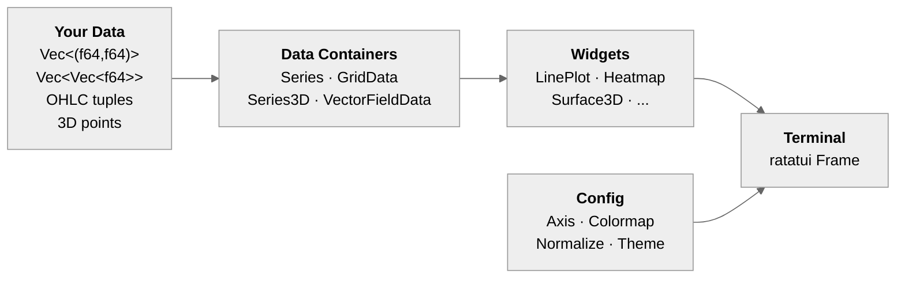

# ratatui-plt

**Scientific visualization widgets for [ratatui](https://ratatui.rs/) — matplotlib for the terminal.**

[](https://crates.io/crates/ratatui-plt)
[](https://docs.rs/ratatui-plt)
[](https://www.gnu.org/licenses/gpl-3.0)
[](https://github.com/resonant-jovian/ratatui-plt/actions/workflows/test.yml)
[](https://github.com/resonant-jovian/ratatui-plt/actions/workflows/clippy.yml)
[](https://thanks.dev/u/gh/resonant-jovian)

### Highlights

- **58 plot widgets** — 2D, 3D, statistical, specialized, and layout
- **55+ colormaps** — sequential, diverging, cyclic, qualitative, and custom
- **7 axis scales** — linear, log, symlog, power, logit, asinh, function
- **6 export formats** — text, ANSI, SVG, PNG, Sixel, Kitty
- **72 runnable examples** — including 6 matplotlib showcase replicas

> [!IMPORTANT]
> **Status (0.0.2):** Early release. Most widgets work well, but the following have known rendering quality issues: **BandPlot** (fill gap artifacts), **BoxPlot / BoxenPlot** (outline alignment), **CandlestickPlot** (outline mismatches), **Contour3D** (surface artifacts), **VectorField 3D** (low contrast/density), **TernaryPlot** (staircase grid lines). Expect breaking API changes before 0.1.0.

## Contents

- [For Everyone](#for-everyone) — what it is, install, quick start
- [For Users](#for-users) — widgets, colormaps, themes, examples
- [For Developers](#for-developers) — architecture, traits, conventions, testing
- [License](#license)

> [!TIP]
> **Users** — jump to [Widgets](#widgets) for the full widget catalog, or [Examples](#examples) to run a demo.
> **Developers** — jump to [Architecture](#architecture) for the data-flow diagram and module layout.

---

## For Everyone

`ratatui-plt` is a comprehensive plotting library for terminal UIs built on [ratatui](https://ratatui.rs/). It provides 50+ plot widgets, colormaps, axis systems, and layout tools for scientific computing, simulation monitoring, and data exploration — all rendered in the terminal using Unicode characters for sub-cell resolution.

### How it works



Each widget follows a **builder pattern** — configure data, axes, colors, and theme, then hand it to ratatui's rendering loop.

### Install

```toml
[dependencies]
ratatui-plt = "0.0.2"
ratatui = "0.30"

# Optional features:
# ratatui-plt = { version = "0.0.2", features = ["statistics", "export"] }
```

### Quick start

```rust
use ratatui_plt::prelude::*;

let series = Series::new("sin(x)")
    .data((0..100).map(|i| {
        let x = i as f64 * 0.1;
        (x, x.sin())
    }).collect())
    .color(Color::Cyan);

let plot = LinePlot::new()
    .series(series)
    .title("Sine Wave")
    .x_axis(Axis::new().label("x").grid(true))
    .y_axis(Axis::new().label("y"));

// In your ratatui draw callback:
frame.render_widget(&plot, area);
```

> [!NOTE]
> **Minimum Supported Rust Version:** Rust edition 2024 (requires Rust 1.85+).

---

## For Users

### Widgets

**2D** — LinePlot, ScatterPlot, Heatmap, Histogram, BarChart, ContourPlot, and 20+ more
**3D** — Surface3D, Wireframe3D, Scatter3D, Bar3D, Contour3D, Quiver3D (all with interactive camera via `Camera3DState`)
**Statistical** — BoxPlot, ViolinPlot, Histogram, ECDF, ErrorBarPlot, JointPlot
**Specialized** — RadialPlot, TernaryPlot, NetworkGraph, SankeyDiagram, SunburstChart, and more
**Layout** — MultiPanel (GridSpec), FacetGrid, TwinAxes, InsetPlot
**Interactive** — Crosshair, DataPicking, Brushing, InteractiveLegend, SpanSelector, LinkedView

<details>
<summary><strong>All 58 widgets</strong></summary>

#### 2D Plots
- **LinePlot** — multiple series, fill regions, step modes, dash patterns, markers
- **ScatterPlot** — color-mapped point clouds, configurable markers, trendline overlays (linear/polynomial/LOWESS)
- **Heatmap** — half-block rendering for 2x vertical resolution, colorbars
- **ImagePlot** — matrix/image display with `imshow`, `spy()`, `matshow()` convenience functions
- **Histogram** — count/density/probability modes, stacked, cumulative
- **BarChart** — grouped and stacked, horizontal/vertical
- **ContourPlot** — filled contours and iso-lines via marching squares
- **BoxPlot** — quartiles, whiskers, outliers, notched and bootstrap CI variants
- **ViolinPlot** — KDE-based distribution shape with quartile markers
- **StairsPlot** — step functions with fill-to-baseline
- **StemPlot** — discrete event / impulse visualization
- **ErrorBarPlot** — symmetric/asymmetric error bars
- **StackedArea** — cumulative filled area charts
- **EventPlot** — spike raster / event timing plots
- **Hist2D** — 2D histogram rendered as heatmap
- **HexbinPlot** — hexagonal binning for large datasets
- **PieChart** — pie/donut charts with explode and labels
- **BandPlot** — uncertainty bands / confidence intervals
- **SwarmPlot** — beeswarm plots with jitter
- **StripPlot** — categorical strip/dot plots
- **CandlestickPlot** — OHLC financial charts
- **ECDF** — empirical cumulative distribution functions
- **RugPlot** — marginal tick marks
- **JointPlot** — scatter with marginal histograms/KDE/rug distributions
- **WaterfallChart** — cumulative positive/negative value bars for financial analysis
- **FunnelChart** — centered decreasing-width bars for conversion funnels
- **GaugeChart** — semicircular gauge with needle indicator for KPI dashboards
- **GanttChart** — horizontal bar segments for scheduling/timeline visualization

#### 3D Plots
- **Surface3D** — colored surface with half-block shading and wireframe
- **Wireframe3D** — depth-cued wireframe mesh with Braille lines
- **Scatter3D** — 3D point cloud with axis lines
- **Bar3D** — 3D bar chart with depth sorting
- **Contour3D** — filled contour surfaces in 3D
- **Quiver3D** — 3D vector field arrows

All 3D widgets support interactive camera control via `Camera3DState` (arrow keys to rotate, +/- to zoom).

#### Specialized Plots
- **RadialPlot** — polar coordinates: line, scatter, bar, fill-between
- **TernaryPlot** — ternary/triangle diagrams with percentage labels
- **NetworkGraph** — force-directed or manual-layout graph visualization
- **ParallelCoords** — parallel coordinates for multivariate data
- **SankeyDiagram** — flow diagrams with node-to-node bands
- **SunburstChart** — hierarchical nested ring charts
- **TreemapChart** — area-proportional hierarchical rectangles
- **DendrogramPlot** — hierarchical clustering trees
- **StreamPlot** — vector field streamlines via Runge-Kutta integration

#### Layout
- **MultiPanel** — GridSpec-like subplot grid with `width_ratios` / `height_ratios`, mosaic syntax, shared axes
- **FacetGrid** — seaborn-style automatic small multiples from grouped data
- **TwinAxes** — dual y-axis overlay with independent scales
- **InsetPlot** — zoomed inset panels with highlighted source regions

#### Interactivity
- **Crosshair** — cursor overlay with coordinate readout
- **Data Picking** — nearest-point detection for hover tooltips
- **Brushing** — rectangular selection with `SharedBrush` for linked plots
- **InteractiveLegend** — click-to-toggle series visibility with `SharedLegendState`
- **SpanSelector** — horizontal/vertical range selection overlay
- **RectangleSelector** — 2D rectangular selection overlay
- **LinkedView** — synchronized pan/zoom bounds across multiple panels with `SharedView`

</details>

### Colormaps

55+ built-in colormaps across 8 families, plus custom `ListedColormap` and `LinearSegmentedColormap`:

- **Sequential**: Viridis, Plasma, Inferno, Magma, Cividis
- **Diverging**: Coolwarm, RdBu, Seismic, RdYlBu, ...
- **Qualitative**: Paired, Set1, Tab20, ...
- Colorbar widget with extend modes for out-of-range values

<details>
<summary><strong>All colormap families</strong></summary>

- **Sequential**: Viridis, Plasma, Inferno, Magma, Cividis
- **Diverging**: Coolwarm, RdBu, Seismic, RdYlBu, RdYlGn, BrBG, PiYG, PRGn, PuOr, RdGy, Spectral
- **Cyclic**: Hsv, Twilight
- **Seasonal**: Spring, Summer, Autumn, Winter
- **Monotone**: Blues, Greens, Greys, Oranges, Reds, Purples + multi-hue sequentials
- **Qualitative**: Paired, Set1, Set2, Set3, Accent, Dark2, Pastel1, Pastel2, Tab20, Tab20b, Tab20c
- **Miscellaneous**: Grayscale, Jet, Turbo, Hot
- **Custom**: `ListedColormap` and `LinearSegmentedColormap` from user-defined color stops

</details>

### Axis System

- **Scales**: Linear, Log, SymLog, Power, Logit, Asinh, Function (custom)
- **Aspect Ratio**: `Auto`, `Equal`, `Fixed(ratio)` with terminal cell geometry compensation
- **Tick Locators**: `MaxNLocator`, `LogLocator`, `MultipleLocator`, `FixedLocator`, `CategoricalLocator`, `AutoMinorLocator`, `NullLocator`
- **Tick Formatters**: `ScalarFormatter`, `LogFormatter`, `SiFormatter`, `PercentFormatter`, `FuncFormatter`, `CategoricalFormatter`, `NullFormatter`
- **Overlap detection**: x-axis labels are automatically skipped when they would collide

### Rendering

- **Braille sub-pixel lines** — 2x4 dots per cell for smooth curves and diagonals
- **Half-block characters** — `▀`/`▄` for 2x vertical resolution in heatmaps and surfaces
- **Unicode box-drawing** — clean axis borders and chart outlines
- **Depth sorting** — painter's algorithm for correct 3D occlusion

### Themes

- 5 presets: `dark`, `light`, `minimal`, `publication`, `solarized`
- Global default via `Theme::set_default()` with RAII guard via `Theme::activate()`
- TOML file loading (with `toml-themes` feature)
- All interactive examples accept a theme CLI argument

<details>
<summary><strong>9 normalization modes</strong></summary>

- `LinearNorm`, `LogNorm`, `SymLogNorm`, `PowerNorm`, `BoundaryNorm`, `TwoSlopeNorm`, `CenteredNorm`, `AsinhNorm`, `FuncNorm`
- Trait-based: implement `Normalize` for custom mappings

</details>

### MathText

- Greek letters: `\alpha` → α, `\beta` → β, `\Sigma` → Σ
- Superscripts: `x^2` → x², `10^{-3}` → 10⁻³
- Subscripts: `x_0` → x₀
- Scientific notation formatting

### Annotations & Legend

- `Annotation` with optional arrow styles (`Arrow`, `Simple`)
- `Legend` with configurable position and multi-column layout
- `InteractiveLegend` with toggle visibility
- Reference lines and spans (`axhline`, `axvline`, `axhspan`, `axvspan`)
- Spines control (show/hide individual axis borders)

### Export

- **Text** — plain Unicode (no color)
- **ANSI** — 24-bit true color terminal escape sequences
- **SVG** — monospace font rendering with cell-based layout
- **PNG** — raster export via the `image` crate (requires `export` feature)
- **Sixel** — inline terminal graphics for Sixel-compatible terminals (requires `sixel` feature)
- **Kitty** — inline terminal graphics for Kitty-compatible terminals (requires `kitty` feature)

> [!NOTE]
> **Terminal compatibility for image export:**
>
> | Protocol | Supported terminals |
> |----------|-------------------|
> | **Kitty** | Kitty, WezTerm, Ghostty |
> | **Sixel** | foot, WezTerm, mlterm, xterm (`-ti vt340`), contour |
> | **Both** | WezTerm |
>
> GNOME Terminal, Alacritty, and most VTE-based terminals do **not** support Sixel or Kitty graphics. PNG export works everywhere (saves to file). Text/ANSI/SVG export requires no feature flags and works in any terminal.

### Optional Features

| Feature | Dependencies | Description |
|---------|-------------|-------------|
| `export` | `resvg`, `usvg`, `tiny-skia`, `svg2pdf`, `image` | PNG raster export |
| `kitty` | (implies `export`) | Kitty graphics protocol inline output |
| `sixel` | `image` (implies `export`) | Sixel graphics protocol inline output |
| `statistics` | (none, pure Rust) | KDE, linear/polynomial regression, LOWESS, bootstrap CI, trendlines |
| `toml-themes` | `toml` (implies `serde`) | Load themes from TOML files |
| `async` | `tokio` | Animation loop, streaming data, background computation |
| `chrono` | `chrono` | Timestamp axis support |
| `serde` | `serde` | Serialization for data types |
| `fft` | `rustfft` | Power spectral density and spectrogram plots |
| `triangulation` | `delaunator` | Delaunay triangulation for unstructured data |

### Examples

70+ examples are included. Run any interactive example with:
```bash
cargo run --example <name>
# Pass a theme:
cargo run --example line_plot -- light
```

Feature-gated examples require the feature flag:
```bash
cargo run --example statistics --features statistics
cargo run --example trendline --features statistics
cargo run --example kitty_export --features kitty
cargo run --example sixel_export --features sixel
cargo run --example toml_theme --features toml-themes
```

Run examples with `dev.sh`:
```bash
./dev.sh examples line_plot              # single example
./dev.sh examples line_plot --theme dark # with theme
./dev.sh examples --group 3d            # all 3D examples
./dev.sh examples --all --theme dark    # all examples, dark theme
./dev.sh examples --list                # list groups
```

#### Showcase Examples (matplotlib reference replicas)

Six showcase examples replicate matplotlib's reference plot gallery using `MultiPanel` grids:

| Example | Plots |
|---------|-------|
| `showcase_basic_2d` | LinePlot, ScatterPlot, BarChart, Histogram, PieChart, StairsPlot, StemPlot |
| `showcase_statistical` | BoxPlot, ViolinPlot, ErrorBarPlot, EcdfPlot, EventPlot |
| `showcase_grid` | ContourPlot (unfilled + filled), Heatmap, Pcolormesh, HexbinPlot, Hist2D, VectorField, StreamPlot |
| `showcase_fill` | BandPlot (fill_between), StackedArea |
| `showcase_tri` | TriPlot, TriContour (unfilled + filled), TriColor |
| `showcase_3d` | Surface3D, Wireframe3D, Scatter3D, Bar3D, Quiver3D |

<details>
<summary><strong>All 72 examples</strong></summary>

| Example | Description |
|---------|-------------|
| `line_plot` | Sine/cosine with fill, legend, grid |
| `scatter_plot` | Color-mapped point cloud |
| `heatmap` | Correlation matrix with Viridis colorbar |
| `image_plot` | Matrix display with `matshow`, `spy`, bilinear interpolation |
| `histogram` | Stacked distributions |
| `contour` | Filled 2D potential field |
| `surface3d` | Interactive 3D surface with camera |
| `wireframe3d` | Depth-cued 3D wireframe |
| `scatter3d` | 3D point cloud |
| `bar3d` | 3D bar chart with axis lines |
| `box_plot` | Standard, notched, and bootstrap CI |
| `violin_plot` | KDE distribution shapes |
| `candlestick` | OHLC financial price action |
| `ecdf` | Empirical CDFs for 3 distributions |
| `stairs` | Step function plot |
| `band` | Uncertainty bands (confidence intervals) |
| `rug` | Histogram + KDE + rug marks |
| `swarm` | Beeswarm by browser |
| `strip` | Gene expression by cell type |
| `stem_plot` | Discrete impulse events |
| `error_bar` | Symmetric/asymmetric error bars |
| `stacked_area` | Cumulative filled areas |
| `bar_chart` | Grouped/stacked bars |
| `pie_chart` | Pie/donut chart |
| `hexbin` | Hexagonal binning |
| `hist2d` | 2D histogram |
| `event_plot` | Spike raster |
| `joint_plot` | Scatter with marginal histograms and KDE |
| `waterfall` | Financial waterfall (P&L) chart |
| `funnel` | Sales conversion funnel |
| `gauge` | KPI gauge with colored sectors |
| `gantt` | Project timeline Gantt chart |
| `facet_grid` | Seaborn-style faceted scatter |
| `radial` | Polar line, scatter, bar, fill |
| `ternary` | Soil texture triangle |
| `network` | Social network graph |
| `parallel_coords` | Iris dataset parallel coordinates |
| `sankey` | Energy flow Sankey diagram |
| `sunburst` | World population sunburst |
| `treemap` | Hierarchical treemap |
| `dendrogram` | Clustering tree |
| `streamplot` | Circular flow field |
| `vector_field` | 3D vector field dipole |
| `collections` | LineCollection / PathCollection |
| `multi_panel` | 4-panel subplot grid |
| `twin_axes` | Dual y-axis overlay |
| `inset` | Damped sine with zoomed inset |
| `crosshair` | Interactive crosshair |
| `picking` | Nearest-point data picking |
| `interactive_legend` | Click-to-toggle series visibility |
| `span_selector` | Horizontal range selection |
| `scientific_dashboard` | Full 4-panel simulation monitor |
| `theme_config` | Built-in theme gallery |
| `pcolormesh` | Pseudocolor mesh plot |
| `triplot` | Triangulation mesh |
| `tricolor` | Triangulated color map |
| `contour3d` | 3D contour surface |
| `quiver3d` | 3D vector arrows |
| `boxen` | Letter-value (boxen) plot |
| `statistics` | Regression + KDE + LOWESS overlays (requires `statistics`) |
| `trendline` | Scatter with polynomial trendline (requires `statistics`) |
| `kitty_export` | Inline Kitty image output (requires `kitty`) |
| `sixel_export` | Inline Sixel image output (requires `sixel`) |
| `toml_theme` | Load theme from TOML string (requires `toml-themes`) |

</details>

### Convenience Macros

```rust
let s = series!("sin(x)", [(0.0, 0.0), (1.0, 0.84), (2.0, 0.91)]);
let p = plot!(title = "My Plot", series1, series2);
let h = heatmap_widget!(grid_data, Plasma);
let panel = subplot!(2, 2, gap = 1);
let cmap = colormap_custom!("div", 0.0 => Color::Blue, 0.5 => Color::White, 1.0 => Color::Red);
```

---

## For Developers

### Architecture

The crate follows a layered design:

1. **Data containers** (`series.rs`) — `Series`, `Series3D`, `GridData`, `VectorFieldData`. All plot widgets consume these.
2. **Configuration** (`axis.rs`, `norm.rs`, `colormap.rs`, `ticker.rs`, `theme.rs`) — scales, normalization, colormaps, tick generation, themes.
3. **Widgets** (`widgets/`) — 58 plot widgets, each implementing ratatui's `Widget` or `StatefulWidget` trait via builder pattern.
4. **Rendering helpers** (`drawing.rs`, `plot_buffer.rs`, `transform.rs`) — Braille/half-block drawing, Z-buffered rendering, 3D camera transforms.
5. **Export** (`export.rs`) — text, ANSI, SVG, PNG, Sixel, Kitty output.

### Key conventions

- **Builder pattern everywhere** — all widgets: `LinePlot::new().series(s).title("Plot").x_axis(...)`
- **Reference rendering** — widgets implement `Widget for &WidgetName` for zero-copy reuse
- **3D uses StatefulWidget** — 3D widgets use `Camera3DState` for interactive camera control
- **Half-block characters** — `Heatmap` uses `▀`/`▄` for 2x vertical resolution
- **Prelude** — `use ratatui_plt::prelude::*` imports all commonly needed types
- **Trait extensibility** — `Normalize`, `Colormap`, `TickLocator`, `TickFormatter` are all public traits users can implement

### Builder API

```rust
// All widgets follow the same builder pattern:
let plot = LinePlot::new()
    .series(series)
    .title("My Plot")
    .x_axis(Axis::new().label("x").scale(Scale::Log).grid(true))
    .y_axis(Axis::new().label("y"))
    .theme(Theme::publication());

// 3D widgets use StatefulWidget:
let mut camera = Camera3DState::default();
frame.render_stateful_widget(&surface, area, &mut camera);
```

### Testing

Integration tests in `tests/integration.rs`. Tests cover data types, normalization, ticks, colormaps, mathtext, 3D transforms, and widget rendering.

```bash
cargo test                           # Run all tests
cargo clippy                         # Lint
cargo doc --open                     # Build and view docs
```

> [!TIP]
> See the [API documentation on docs.rs](https://docs.rs/ratatui-plt) for full type-level documentation.

---

## Support

If ratatui-plt is useful to your projects, consider supporting development via [thanks.dev](https://thanks.dev/u/gh/resonant-jovian).

## License

This project is licensed under the [GNU General Public License v3.0](https://www.gnu.org/licenses/gpl-3.0.en.html). See [LICENSE](LICENSE) for details.
