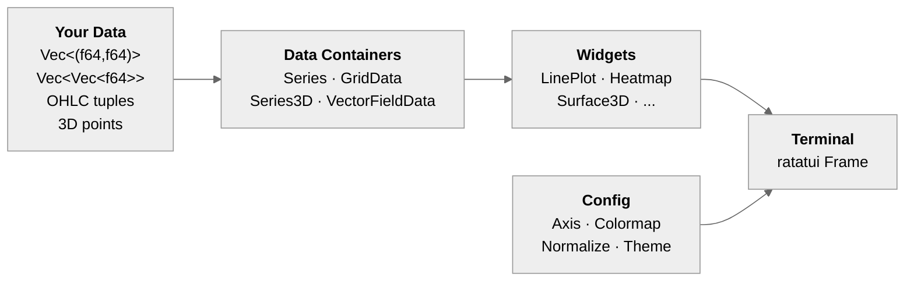

# ratatui-plt

**Scientific visualization widgets for [ratatui](https://ratatui.rs/) — matplotlib for the terminal.**

[](https://crates.io/crates/ratatui-plt)
[](https://docs.rs/ratatui-plt)
[](https://www.gnu.org/licenses/gpl-3.0)
[](https://thanks.dev/u/gh/resonant-jovian)

[](https://github.com/resonant-jovian/ratatui-plt/actions/workflows/test.yml)
[](https://github.com/resonant-jovian/ratatui-plt/actions/workflows/clippy.yml)

### Highlights

- **80 plot widgets** — 2D, 3D, statistical, financial, hierarchical, scientific, and layout
- **55+ colormaps** — sequential, diverging, cyclic, qualitative, and custom
- **7 axis scales** — linear, log, symlog, power, logit, asinh, function
- **6 export formats** — text, ANSI, SVG, PNG, Sixel, Kitty
- **PlotBackend trait** — extensible rendering backend for Unicode, Kitty, Sixel
- **51 gallery-quality examples** — including 13 multi-panel matplotlib-style showcases

> [!IMPORTANT]
> **Status (0.1.0):** First stable API release. 80 widgets covering the full matplotlib/seaborn/plotly chart taxonomy. Pluggable `PlotBackend` trait with Unicode (default), Kitty, and Sixel rendering backends. Breaking changes from 0.0.3: all widgets now render through `dyn PlotBackend` instead of `PlotBuffer` directly.

## Contents

- [For Everyone](#for-everyone) — what it is, install, quick start
- [For Users](#for-users) — widgets, colormaps, themes, examples
- [For Developers](#for-developers) — architecture, traits, conventions, testing
- [License](#license)

> [!TIP]
> **Users** — jump to [Widgets](#widgets) for the full widget catalog, or [Examples](#examples) to run a demo.
> **Developers** — jump to [Architecture](#architecture) for the data-flow diagram and module layout.

---

## For Everyone

`ratatui-plt` is a comprehensive plotting library for terminal UIs built on [ratatui](https://ratatui.rs/). It provides 80 plot widgets, colormaps, axis systems, and layout tools for scientific computing, simulation monitoring, and data exploration — all rendered in the terminal using Unicode characters for sub-cell resolution.

### How it works



Each widget follows a **builder pattern** — configure data, axes, colors, and theme, then hand it to ratatui's rendering loop.

### Install

```toml
[dependencies]
ratatui-plt = "0.1.0"
ratatui = "0.30"

# Optional features:
# ratatui-plt = { version = "0.1.0", features = ["statistics", "export"] }
```

### Quick start

```rust
use ratatui_plt::prelude::*;

let series = Series::new("sin(x)")
    .data((0..100).map(|i| {
        let x = i as f64 * 0.1;
        (x, x.sin())
    }).collect())
    .color(Color::Cyan);

let plot = LinePlot::new()
    .series(series)
    .title("Sine Wave")
    .x_axis(Axis::new().label("x").grid(true))
    .y_axis(Axis::new().label("y"));

// In your ratatui draw callback:
frame.render_widget(&plot, area);
```

> [!NOTE]
> **Minimum Supported Rust Version:** Rust edition 2024 (requires Rust 1.87+).

---

## For Users

### Widgets

**Core** — LinePlot, ScatterPlot, Heatmap, Histogram, BarChart, AreaChart, PieChart, ImagePlot, DataTable
**Statistical** — BoxPlot, BoxenPlot, ViolinPlot, KDEPlot, RegressionPlot, RidgelinePlot, QQPlot, DotPlot, ConfidenceEllipse, and more
**Scientific** — ContourPlot, StreamPlot, VectorField, HorizonGraph, CarpetPlot, SmithChart, ChoroplethMap, and more
**Financial** — CandlestickChart (with OHLC mode), WaterfallChart, GanttChart, GaugeChart, FunnelChart, FunnelArea
**Hierarchical** — Treemap, Sunburst, IcicleChart, SankeyDiagram, Dendrogram, ClusterMap, ParallelCategories
**3D** — Surface3D (with wireframe mode), Scatter3D, Line3D, Mesh3D, Bar3D, Voxels, Isosurface, Volume3D, Streamtube, and more
**Polar** — RadialPlot (also RadarPlot), TernaryPlot
**Layout** — MultiPanel, FacetGrid (with free scales, col_wrap), TwinAxes, InsetPlot, JointPlot, PairPlot
**Interactive** — Crosshair, Brushing, InteractiveLegend, SpanSelector, RectangleSelector, LassoSelector, LinkedView

<details>
<summary><strong>All 80 widgets</strong></summary>

#### Core Visualization
- **LinePlot** — multiple series, spline interpolation, fill-to shading, CI aggregation, step modes, markers
- **ScatterPlot** — color-mapped point clouds, bubble mode (size mapping), trendline overlays (linear/polynomial/LOWESS)
- **Heatmap** — half-block rendering for 2x vertical resolution, colorbars, value annotations, center/robust scaling
- **ImagePlot** — matrix/image display with `imshow`, `spy()`, `matshow()` convenience functions
- **Histogram** — count/density/probability/percent modes, stacked/layered/side-by-side, KDE overlay
- **BarChart** — grouped, stacked, diverging stacked, horizontal/vertical, auto value labels
- **AreaChart** — plain, stacked, normalized, streamgraph modes
- **PieChart** — pie/donut charts with explode and labels
- **DataTable** — styled data table with colormap cell backgrounds

#### Statistical
- **BoxPlot** — quartiles, whiskers, outliers, notched CI, show-all-points overlay
- **BoxenPlot** — letter-value plots for large dataset distributions
- **ViolinPlot** — KDE-based shape with split mode, density normalization (area/count/width)
- **KDEPlot** — smooth 1D kernel density estimation curves with fill
- **RegressionPlot** — scatter + fitted regression line + confidence interval band
- **RidgelinePlot** — vertically offset overlapping KDE curves per category
- **QQPlot** — quantile-quantile diagnostic with reference line
- **DotPlot** — Wilkinson stacked dots in bins
- **ConfidenceEllipse** — 2D covariance ellipse overlay on scatter
- **ErrorBarPlot** — symmetric/asymmetric error bars
- **BandPlot** — uncertainty bands / confidence intervals
- **SwarmPlot** — beeswarm non-overlapping plots
- **StripPlot** — categorical strip plots with jitter
- **EcdfPlot** — empirical cumulative distribution functions
- **RugPlot** — marginal tick marks

#### Scientific
- **ContourPlot** — filled contours and iso-lines via marching squares
- **StreamPlot** — vector field streamlines via Runge-Kutta integration
- **VectorField** — 2D arrow glyph vector field
- **HorizonGraph** — compact multi-band time-series visualization
- **Hist2D** — 2D histogram rendered as heatmap
- **HexbinPlot** — hexagonal binning for large datasets
- **Pcolormesh** — pseudocolor plot of 2D array
- **StairsPlot** — step functions with fill-to-baseline
- **StemPlot** — discrete event / impulse visualization
- **EventPlot** — spike raster / event timing plots
- **CarpetPlot** — curvilinear parameter-space grid with coloring
- **SmithChart** — RF impedance chart with constant-R/X circles
- **ChoroplethMap** — tile-based geographic region coloring
- **PSD** — power spectral density (fft feature)
- **Spectrogram** — time-frequency display (fft feature)

#### Financial
- **CandlestickChart** — OHLC financial charts (candlestick and OHLC bar modes)
- **WaterfallChart** — cumulative positive/negative value bars
- **GanttChart** — horizontal bar segments for scheduling/timeline
- **GaugeChart** — semicircular gauge with needle indicator
- **FunnelChart** — centered decreasing-width conversion bars
- **FunnelArea** — trapezoidal proportional-area funnel

#### Hierarchical & Relational
- **TreemapChart** — area-proportional hierarchical rectangles
- **SunburstChart** — hierarchical nested ring charts
- **IcicleChart** — rectangular hierarchy with orientation options
- **SankeyDiagram** — flow diagrams with node-to-node bands
- **DendrogramPlot** — hierarchical clustering trees
- **ClusterMap** — heatmap with row/column dendrograms
- **NetworkGraph** — force-directed or manual-layout graph visualization
- **ParallelCoords** — parallel coordinates for multivariate data
- **ParallelCategories** — categorical flow ribbons between dimensions

#### Polar & Specialized
- **RadialPlot** — polar coordinates: line, scatter, bar, fill-between (also aliased as RadarPlot)
- **TernaryPlot** — ternary/triangle diagrams with percentage labels

#### 3D Visualization
- **Surface3D** — colored surface with filled/wireframe/both render modes
- **Scatter3D** — 3D point cloud with axis lines
- **Line3D** — 3D parametric lines/trajectories with depth-cued brightness
- **Mesh3D** — arbitrary triangle mesh with painter's algorithm
- **Bar3D** — 3D bar chart with depth sorting
- **Contour3D** — filled contour surfaces in 3D
- **Quiver3D** — 3D vector field arrows
- **Voxels** — 3D colored cube grid
- **Isosurface** — marching cubes on 3D scalar field
- **Volume3D** — volumetric rendering via ray compositing
- **Streamtube** — thick depth-cued 3D streamlines

All 3D widgets support interactive camera control via `Camera3DState` (arrow keys to rotate, +/- to zoom).

#### Triangulation
- **TriPlot** — triangulated mesh display
- **TriContour** — contours on unstructured triangulated data
- **TriColor** — color-filled triangulation

#### Layout
- **MultiPanel** — GridSpec-like subplot grid with `width_ratios` / `height_ratios`, mosaic syntax
- **FacetGrid** — automatic small multiples with free scales, column wrap, margin titles
- **TwinAxes** — dual y-axis overlay with independent scales
- **InsetPlot** — zoomed inset panels with highlighted source regions
- **JointPlot** — scatter with marginal histograms/KDE/rug distributions
- **PairPlot** — N x N scatter matrix with KDE/histogram diagonals

#### Interactivity
- **Crosshair** — cursor overlay with coordinate readout
- **Data Picking** — nearest-point detection for hover tooltips
- **Brushing** — rectangular selection with `SharedBrush` for linked plots
- **InteractiveLegend** — click-to-toggle series visibility with `SharedLegendState`
- **SpanSelector** — horizontal/vertical range selection overlay
- **RectangleSelector** — 2D rectangular selection overlay
- **LassoSelector** — freehand polygon selection
- **LinkedView** — synchronized pan/zoom bounds across multiple panels with `SharedView`

</details>

### Colormaps

55+ built-in colormaps across 8 families, plus custom `ListedColormap` and `LinearSegmentedColormap`:

- **Sequential**: Viridis, Plasma, Inferno, Magma, Cividis
- **Diverging**: Coolwarm, RdBu, Seismic, RdYlBu, ...
- **Qualitative**: Paired, Set1, Tab20, ...
- Colorbar widget with extend modes for out-of-range values

<details>
<summary><strong>All colormap families</strong></summary>

- **Sequential**: Viridis, Plasma, Inferno, Magma, Cividis
- **Diverging**: Coolwarm, RdBu, Seismic, RdYlBu, RdYlGn, BrBG, PiYG, PRGn, PuOr, RdGy, Spectral
- **Cyclic**: Hsv, Twilight
- **Seasonal**: Spring, Summer, Autumn, Winter
- **Monotone**: Blues, Greens, Greys, Oranges, Reds, Purples + multi-hue sequentials
- **Qualitative**: Paired, Set1, Set2, Set3, Accent, Dark2, Pastel1, Pastel2, Tab20, Tab20b, Tab20c
- **Miscellaneous**: Grayscale, Jet, Turbo, Hot
- **Custom**: `ListedColormap` and `LinearSegmentedColormap` from user-defined color stops

</details>

### Axis System

- **Scales**: Linear, Log, SymLog, Power, Logit, Asinh, Function (custom)
- **Aspect Ratio**: `Auto`, `Equal`, `Fixed(ratio)` with terminal cell geometry compensation
- **Tick Locators**: `MaxNLocator`, `LogLocator`, `MultipleLocator`, `FixedLocator`, `CategoricalLocator`, `AutoMinorLocator`, `NullLocator`
- **Tick Formatters**: `ScalarFormatter`, `LogFormatter`, `SiFormatter`, `PercentFormatter`, `FuncFormatter`, `CategoricalFormatter`, `NullFormatter`
- **Overlap detection**: x-axis labels are automatically skipped when they would collide

### Rendering

- **Braille sub-pixel lines** — 2x4 dots per cell for smooth curves and diagonals
- **Half-block characters** — `▀`/`▄` for 2x vertical resolution in heatmaps and surfaces
- **Unicode box-drawing** — clean axis borders and chart outlines
- **Depth sorting** — painter's algorithm for correct 3D occlusion

### Themes

- 6 presets: `dark`, `light`, `minimal`, `publication`, `solarized`, `gruvbox`
- Global default via `Theme::set_default()` with RAII guard via `Theme::activate()`
- TOML file loading (with `toml-themes` feature)
- All interactive examples accept a theme CLI argument

<details>
<summary><strong>9 normalization modes</strong></summary>

- `LinearNorm`, `LogNorm`, `SymLogNorm`, `PowerNorm`, `BoundaryNorm`, `TwoSlopeNorm`, `CenteredNorm`, `AsinhNorm`, `FuncNorm`
- Trait-based: implement `Normalize` for custom mappings

</details>

### MathText

- Greek letters: `\alpha` → α, `\beta` → β, `\Sigma` → Σ
- Superscripts: `x^2` → x², `10^{-3}` → 10⁻³
- Subscripts: `x_0` → x₀
- Scientific notation formatting

### Annotations & Legend

- `Annotation` with optional arrow styles (`Arrow`, `Simple`)
- `Legend` with configurable position and multi-column layout
- `InteractiveLegend` with toggle visibility
- Reference lines and spans (`axhline`, `axvline`, `axhspan`, `axvspan`)
- Spines control (show/hide individual axis borders)

### Export

- **Text** — plain Unicode (no color)
- **ANSI** — 24-bit true color terminal escape sequences
- **SVG** — monospace font rendering with cell-based layout
- **PNG** — raster export via the `image` crate (requires `export` feature)
- **Sixel** — inline terminal graphics for Sixel-compatible terminals (requires `sixel` feature)
- **Kitty** — inline terminal graphics for Kitty-compatible terminals (requires `kitty` feature)

> [!NOTE]
> **Terminal compatibility for image export:**
>
> | Protocol | Supported terminals |
> |----------|-------------------|
> | **Kitty** | Kitty, WezTerm, Ghostty |
> | **Sixel** | foot, WezTerm, mlterm, xterm (`-ti vt340`), contour |
> | **Both** | WezTerm |
>
> GNOME Terminal, Alacritty, and most VTE-based terminals do **not** support Sixel or Kitty graphics. PNG export works everywhere (saves to file). Text/ANSI/SVG export requires no feature flags and works in any terminal.

### Optional Features

| Feature | Dependencies | Description |
|---------|-------------|-------------|
| `export` | `resvg`, `usvg`, `tiny-skia`, `svg2pdf`, `image` | PNG raster export |
| `kitty` | (implies `export`) | Kitty graphics protocol inline output |
| `sixel` | `image` (implies `export`) | Sixel graphics protocol inline output |
| `statistics` | (none, pure Rust) | KDE, linear/polynomial regression, LOWESS, bootstrap CI, trendlines |
| `toml-themes` | `toml` (implies `serde`) | Load themes from TOML files |
| `async` | `tokio` | Animation loop, streaming data, background computation |
| `chrono` | `chrono` | Timestamp axis support |
| `serde` | `serde` | Serialization for data types |
| `fft` | `rustfft` | Power spectral density and spectrogram plots |
| `triangulation` | `delaunator` | Delaunay triangulation for unstructured data |
| `unicode-extended` | (none) | Extended Unicode characters for pie chart arcs |

### Examples

51 gallery-quality examples organized as 13 multi-panel showcases + 36 focused standalone demos. Run any example with:
```bash
cargo run --example <name>
# Pass a theme:
cargo run --example line_plot -- light
```

Feature-gated examples require the feature flag:
```bash
cargo run --example showcase_features --features statistics
cargo run --example showcase_scientific --features fft
cargo run --example kitty_export --features kitty
cargo run --example sixel_export --features sixel
```

Run examples with `dev.sh`:
```bash
./dev.sh examples line_plot              # single example
./dev.sh examples line_plot --theme dark # with theme
./dev.sh examples --group showcase      # all 13 showcases
./dev.sh examples --group 3d            # all 3D examples
./dev.sh examples --all --theme dark    # all examples, dark theme
./dev.sh examples --list                # list groups
```

#### Showcases (13 multi-panel matplotlib-style galleries)

Each showcase combines 5-11 related widgets in a single `MultiPanel` grid, replicating matplotlib's reference gallery:

| Showcase | Widgets | Panels |
|----------|---------|--------|
| `showcase_basic_2d` | LinePlot, ScatterPlot, BarChart, Histogram, PieChart, AreaChart, StairsPlot, StemPlot, DataTable | 9 |
| `showcase_statistical` | BoxPlot, ViolinPlot, KDEPlot, EcdfPlot, SwarmPlot, StripPlot, DotPlot, RugPlot, ErrorBarPlot, BoxenPlot, EventPlot | 11 |
| `showcase_grid` | ContourPlot (unfilled + filled), Heatmap, Pcolormesh, HexbinPlot, Hist2D, VectorField, StreamPlot | 8 |
| `showcase_fill` | BandPlot, AreaChart (plain, stacked, normalized, streamgraph) | 5 |
| `showcase_tri` | TriPlot, TriContour (unfilled + filled), TriColor | 4 |
| `showcase_3d` | Surface3D (filled + wireframe), Scatter3D, Bar3D, Line3D, Contour3D, Quiver3D | 7 |
| `showcase_hierarchical` | Treemap, Sunburst, IcicleChart, SankeyDiagram, Dendrogram, ClusterMap | 6 |
| `showcase_financial` | CandlestickChart, WaterfallChart, GaugeChart, GanttChart, FunnelChart, FunnelArea | 6 |
| `showcase_polar` | RadialPlot (line, scatter, bar, fill modes), TernaryPlot | 5 |
| `showcase_network` | NetworkGraph, ParallelCoords, ParallelCategories | 3 |
| `showcase_scientific` | HorizonGraph, CarpetPlot, SmithChart, ChoroplethMap, PSD, Spectrogram | 6 |
| `showcase_features` | ScatterPlot+trendline, JointPlot, QQPlot, ConfidenceEllipse | 4 |
| `showcase_unicode` | Marker gallery, arrow styles, border styles, fill levels | 6 |

<details>
<summary><strong>Standalone examples (36)</strong></summary>

**Core** — `line_plot`, `scatter_plot`, `bar_chart`, `histogram`, `heatmap`, `image_plot`, `pie_chart`

**3D (interactive camera)** — `surface3d`, `scatter3d`, `line3d`, `mesh3d`, `bar3d`, `voxels`, `isosurface`, `volume3d`, `streamtube`, `contour3d`, `quiver3d`

**Interactive** — `crosshair`, `picking`, `interactive_legend`, `span_selector`, `rect_selector`, `lasso_selector`

**Layout** — `multi_panel`, `facet_grid`, `twin_axes`, `inset`, `joint_plot`, `pair_plot` (requires `statistics`)

**Composite** — `scientific_dashboard`, `collections`, `regression_plot` (requires `statistics`), `ridgeline` (requires `statistics`)

**Export + Config** — `kitty_export` (requires `kitty`), `sixel_export` (requires `sixel`), `toml_theme` (requires `toml-themes`), `theme_config`

</details>

### Convenience Macros

```rust
let s = series!("sin(x)", [(0.0, 0.0), (1.0, 0.84), (2.0, 0.91)]);
let p = plot!(title = "My Plot", series1, series2);
let h = heatmap_widget!(grid_data, Plasma);
let panel = subplot!(2, 2, gap = 1);
let cmap = colormap_custom!("div", 0.0 => Color::Blue, 0.5 => Color::White, 1.0 => Color::Red);
```

---

## For Developers

### Architecture

The crate follows a layered design:

1. **Data containers** (`series.rs`) — `Series`, `Series3D`, `GridData`, `VectorFieldData`. All plot widgets consume these.
2. **Configuration** (`axis.rs`, `norm.rs`, `colormap.rs`, `ticker.rs`, `theme.rs`) — scales, normalization, colormaps, tick generation, themes.
3. **Widgets** (`widgets/`) — 80 plot widgets, each implementing ratatui's `Widget` or `StatefulWidget` trait via builder pattern.
4. **Rendering helpers** (`drawing.rs`, `plot_buffer.rs`, `transform.rs`) — Braille/half-block drawing, Z-buffered rendering, 3D camera transforms.
5. **Export** (`export.rs`) — text, ANSI, SVG, PNG, Sixel, Kitty output.

### Key conventions

- **Builder pattern everywhere** — all widgets: `LinePlot::new().series(s).title("Plot").x_axis(...)`
- **Reference rendering** — widgets implement `Widget for &WidgetName` for zero-copy reuse
- **3D uses StatefulWidget** — 3D widgets use `Camera3DState` for interactive camera control
- **Half-block characters** — `Heatmap` uses `▀`/`▄` for 2x vertical resolution
- **Prelude** — `use ratatui_plt::prelude::*` imports all commonly needed types
- **Trait extensibility** — `Normalize`, `Colormap`, `TickLocator`, `TickFormatter` are all public traits users can implement

### Builder API

```rust
// All widgets follow the same builder pattern:
let plot = LinePlot::new()
    .series(series)
    .title("My Plot")
    .x_axis(Axis::new().label("x").scale(Scale::Log).grid(true))
    .y_axis(Axis::new().label("y"))
    .theme(Theme::publication());

// 3D widgets use StatefulWidget:
let mut camera = Camera3DState::default();
frame.render_stateful_widget(&surface, area, &mut camera);
```

### Testing

Integration tests in `tests/integration.rs`. Tests cover data types, normalization, ticks, colormaps, mathtext, 3D transforms, and widget rendering.

```bash
cargo test                           # Run all tests
cargo clippy                         # Lint
cargo doc --open                     # Build and view docs
```

> [!TIP]
> See the [API documentation on docs.rs](https://docs.rs/ratatui-plt) for full type-level documentation.

---

## Support

If ratatui-plt is useful to your projects, consider supporting development via [thanks.dev](https://thanks.dev/u/gh/resonant-jovian).

## License

This project is licensed under the [GNU General Public License v3.0](https://www.gnu.org/licenses/gpl-3.0.en.html). See [LICENSE](LICENSE) for details.
